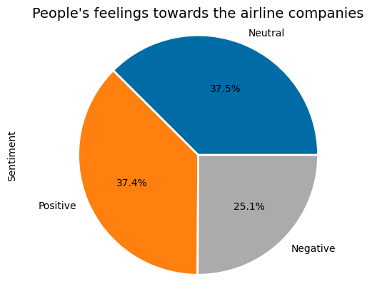
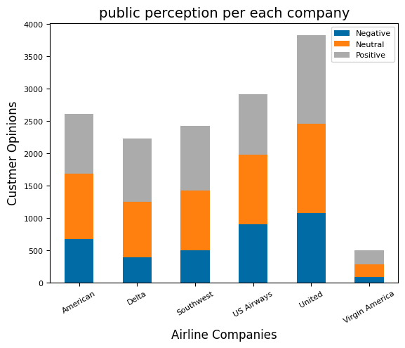
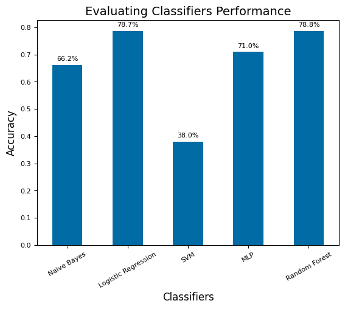

# Airline-Tweet-Sentiment-Analysis
A comprehensive analysis of public airline sentiment based on the 'Twitter US Airline Sentiment' dataset that is available in Kaggle. The project involves four main stages: tweet preprocessing, sentiment labeling, feature extraction, and sentiment classification.

## Install Necessary Libraries
! pip install emoji

## Dataset:
This project uses the "Twitter US Airline Sentiment" dataset available on Kaggle. The dataset provides a collection of tweets with sentiments about different US airlines. The tweets contain information about the sentiment (positive, neutral, or negative) of six US airline companies.

Link: [Twitter US Airline Sentiment on Kaggle](https://www.kaggle.com/datasets/crowdflower/twitter-airline-sentiment/data)

## Methodology
The sentiment analysis project was structured according to the following key phases:

1. **Labeling:** Although the dataset was originally annotated with sentiment labels, we decided to follow our own labeling for a more comprehensive analysis. Labeling was performed using TextBlob Data Labeling.

2. **Preprocessing:** There are various procedures involved in preprocessing tweets for sentiment analysis. Any special characters, digits, URLs, and Twitter identities were first removed. Second, to maintain uniformity, all text is changed to lowercase. The tweets are then tokenized, which involves separating them into separate words or tokens. The tokens are then lemmatized to return them to their original forms.

3. **Feature Extraction:** Feature extraction was used to vectorize data by converting preprocessed text into numerical data using TF-IDF.

4. **Classification:** For sentiment analysis, many classification models were used, including Nave Base, logistic regression, SVM, neural networks, and Random Forest. Then, to analyze the model, we used accuracy to determine how well the classifier performs in predicting the sentiments of the tweets.

## Results:
- Out of the 14640 tweets that were preprocessed, 14485 were successfully cleaned, tokenized, and normalized for further analysis.

- According to the analysis, 5438 tweets expressed neutral customer sentiment, whereas 5415 expressed positive sentiment and 3632 expressed negative sentiment.

 

- Furthermore, the results revealed that the United Company had the highest number of tweets, which resulted in the highest number of positive and negative sentiments.

- Numerous classification models were used to train the sentiment analysis model, including Nave Base, logistic regression, SVM, neural networks, and Random Forest. Random Forest, whose accuracy was 78.8%, had the highest level of precision.

## Contributors

- **Inshirah Idris**: [GitHub](https://github.com/inshirah-idris) | [Linkedin](https://www.linkedin.com/in/inshirah-idris-bb937362/)
- **Taqwa Ahmed**: [GitHub](https://github.com/taqwa315) | [Linkedin](https://www.linkedin.com/in/taqwa-ahmed-681a2646/)
